# gazebo_ardupilot_envorinment
Ubuntu 20.04 ros_noetic and gazebo ardupilot simulation environment installation
This guide outlines the process for installing and configuring a complete simulation environment using ArduPilot, Gazebo, and ROS. It covers creating a ROS workspace, setting up a multi-vehicle simulation, and configuring MAVROS to communicate with each vehicle.

---

### 1. Initial Setup & Prerequisites

1.  **Install ArduPilot and Gazebo.**
2.  **Download the ArduPilot Gazebo Plugin.** It is recommended to download the `ardupilot_gazebo` plugin repository from the user **SwiftGust**. This is beneficial as it includes a variety of pre-configured models and worlds.

---
### 2. Creating the ROS Workspace

1.  **Create a new Catkin Workspace.** In your desired directory, create a new workspace folder.
2.  **Create the Source Directory.** Inside the workspace, create a source (`src`) directory.
    ```bash
    mkdir src
    ```
3.  **Build the Workspace.** Navigate to the root of your workspace directory in the terminal and run `catkin_make`. This command will generate the `build` and `devel` directories.
    ```bash
    catkin_make
    ```
---


### 3. Creating and Configuring a ROS Package

To write and use custom scripts (nodes) within our workspace, we must create a ROS package inside the `src` directory.


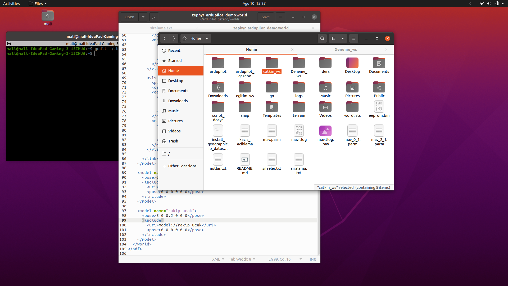
1.  **Create the Package.** Instead of using `mkdir`, use the `catkin_create_package` command. This sets up the necessary package files automatically.
    ```bash
    # Navigate into the src directory
    cd src
    # Create a package with roscpp and rospy dependencies
    catkin_create_package your_package_name roscpp rospy
    ```

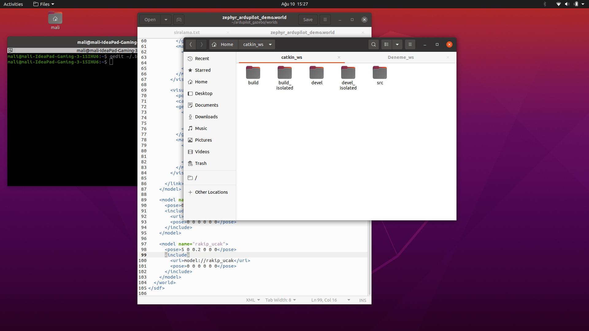
2.  **Modify `CMakeLists.txt`.** Open the `CMakeLists.txt` file located inside your newly created package directory.
    * Find the line:
        ```cmake
        find_package(catkin REQUIRED)
        ```
    * Modify it to include the `roscpp` and `rospy` components:
        ```cmake
        find_package(catkin REQUIRED COMPONENTS roscpp rospy)
        ```
    * Around line 114, find the `include_directories` section and uncomment the `${catkin_INCLUDE_DIRS}` line by removing the `#` symbol at the beginning.


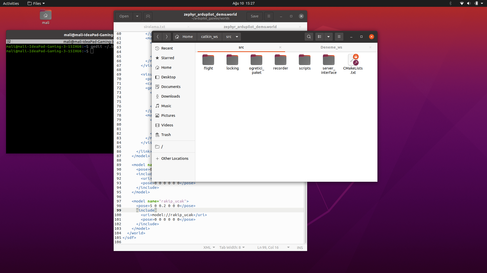

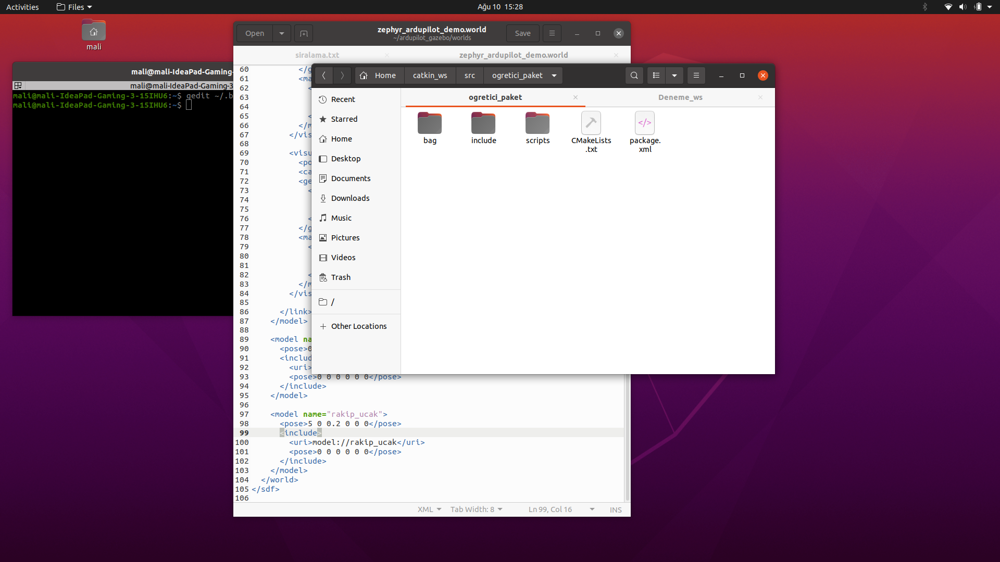
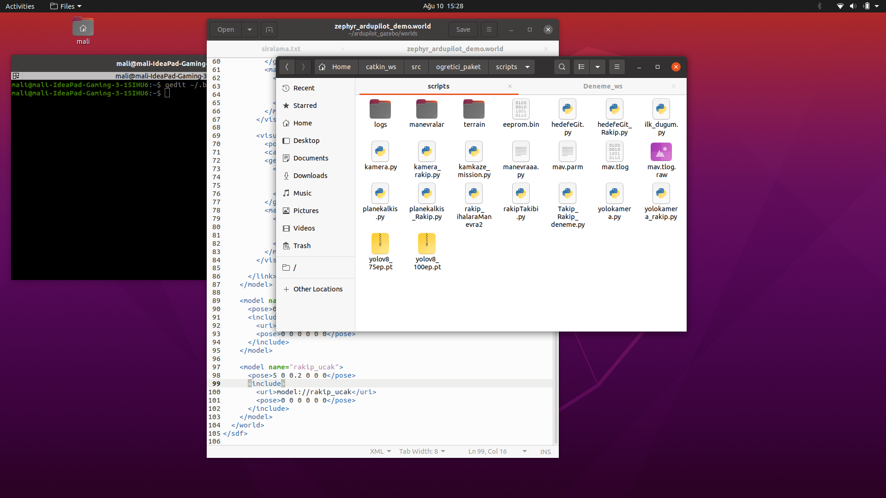
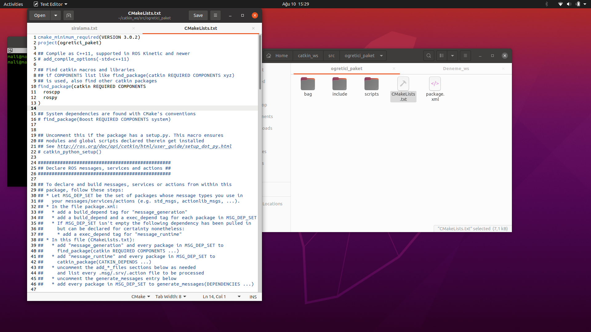
2.  **Modify `CMakeLists.txt`.** Open the `CMakeLists.txt` file located inside your newly created package directory.
    * Find the line:
        ```cmake
        find_package(catkin REQUIRED)
        ```
    * Modify it to include the `roscpp` and `rospy` components:
        ```cmake
        find_package(catkin REQUIRED COMPONENTS roscpp rospy)
        ```
    * Around line 114, find the `include_directories` section and uncomment the `${catkin_INCLUDE_DIRS}` line by removing the `#` symbol at the beginning.


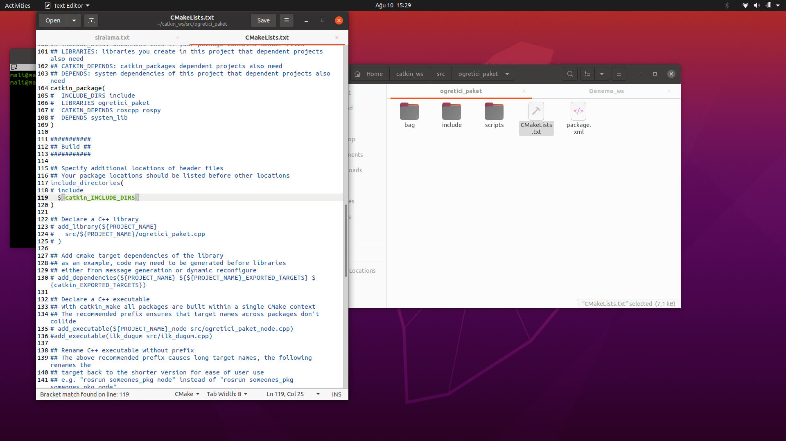

3.  **Source the Workspace.** From the root of your workspace, source the `setup.bash` file. This allows the terminal to recognize the changes and new packages in your workspace.
    ```bash
    source devel/setup.bash
    ```

---
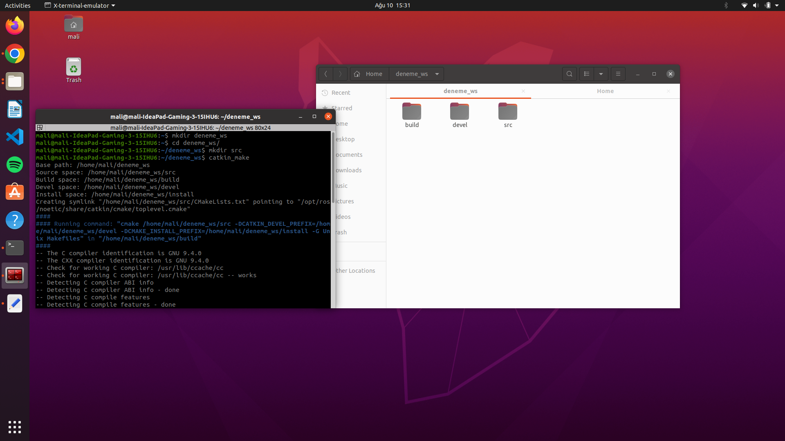
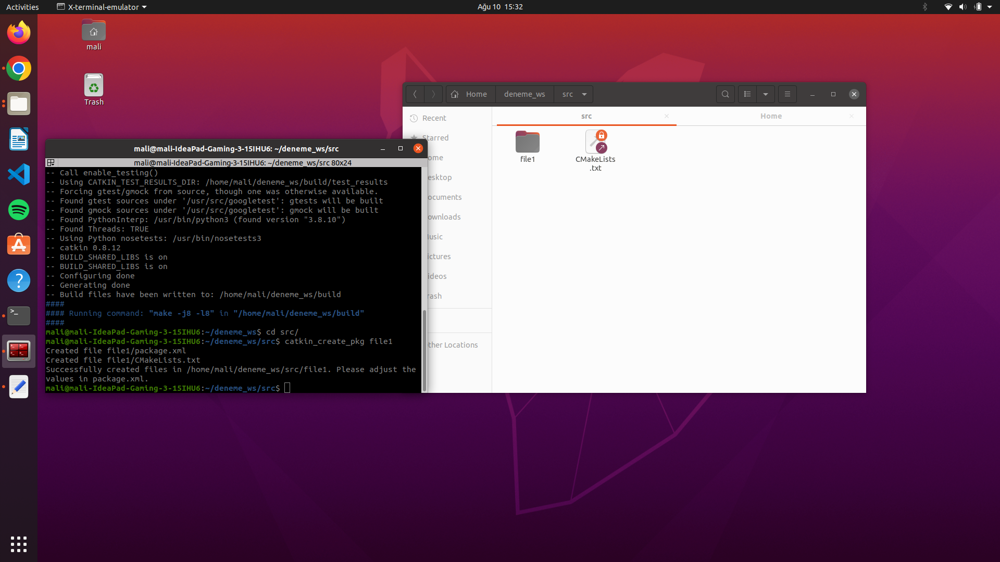
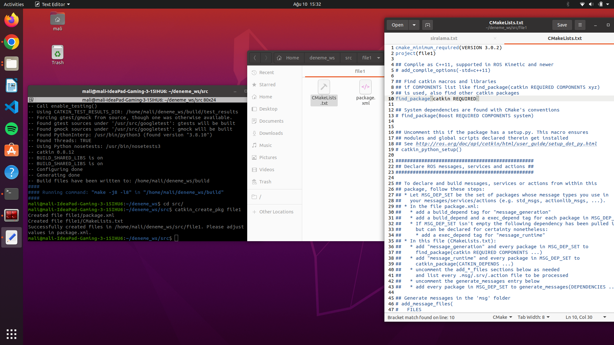
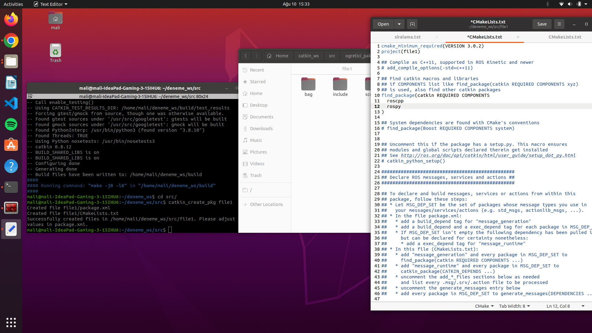
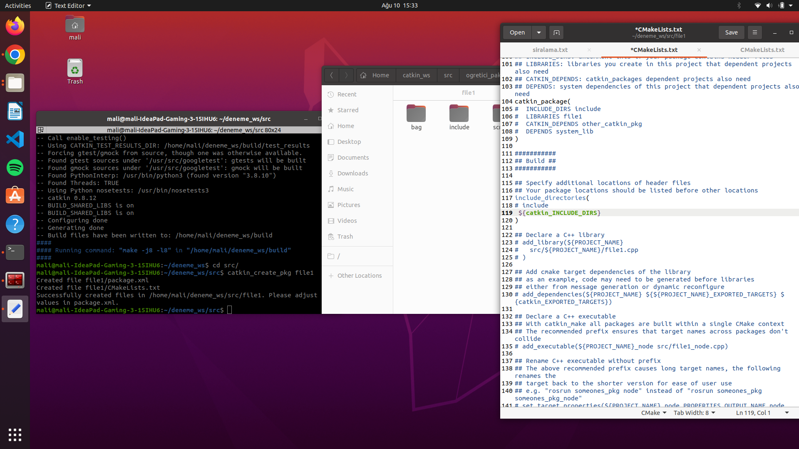
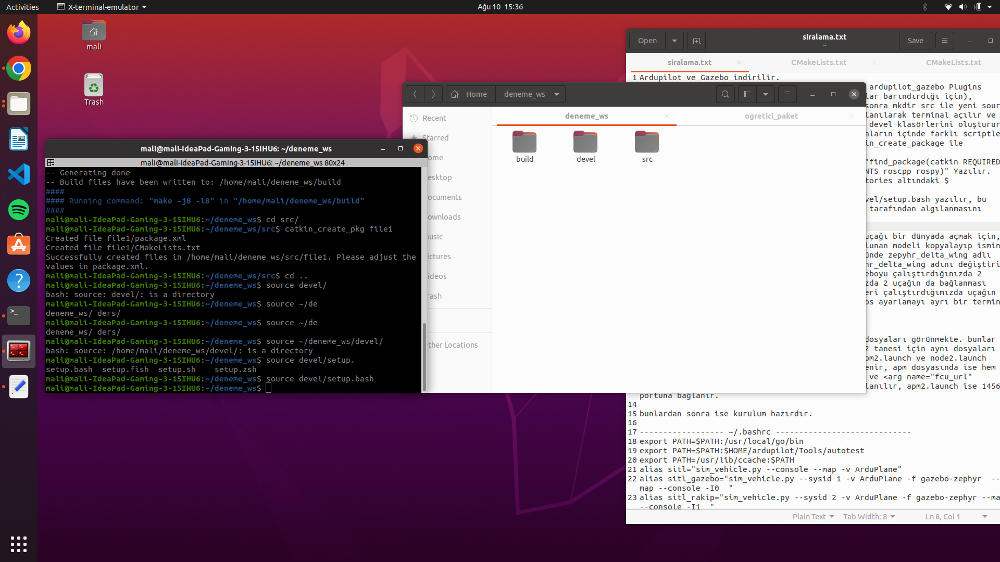
### 4. Setting Up a Multi-Vehicle Simulation

To launch two aircraft in a single Gazebo world, follow these steps:

1.  **Modify the World File.** As an example, open the `zephyr_ardupilot_demo.world` file. At the bottom, you will find a model entry. Copy this entire model block, paste it below the original, and then change the `name` and `<pose>` (position) tags for the new aircraft.
2.  **Duplicate the Aircraft Model.** Navigate to the `models` directory. Copy the `zephyr_delta_wing` model folder and give the copy a unique name (e.g., `zephyr_delta_wing_2`).
3.  **Configure the New Model.** Inside the newly created model folder, edit the `.sdf` and `.config` files. In both files, perform a find-and-replace to change all instances of the old name (`zephyr_delta_wing`) to the new name you chose.

After these changes, when you launch Gazebo with this world file, both aircraft should appear. When you start the ArduPilot SITL instances, both should be able to connect.

---
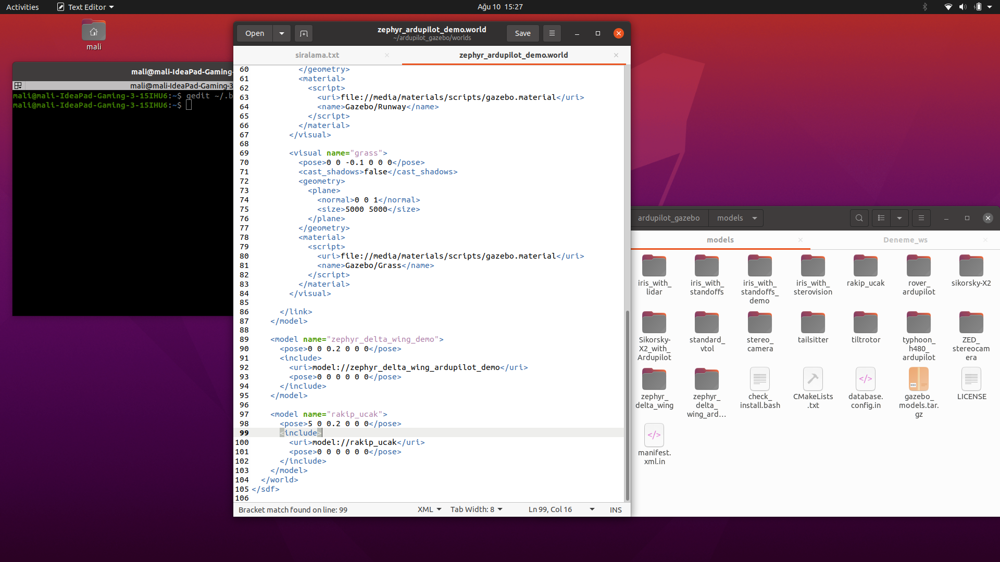
### 5. Configuring MAVROS for Multiple Vehicles

To enable your ROS scripts to communicate with both aircraft, you need to configure separate MAVROS nodes for each.

1.  **Navigate to MAVROS Launch Files.** A common path is `/opt/ros/noetic/share/mavros/launch/`. Once there, you will see files like `node.launch` and `apm.launch`.
2.  **Duplicate the Launch Files.** The default files are configured for a single vehicle. To support two, copy `apm.launch` and `node.launch` to create `apm2.launch` and `node2.launch`.
3.  **Configure the New Nodes.**
    * In `node2.launch`, change the node name from `mavros` to a unique name, for example `mavros_rakip` ("opponent") or `mavros_vehicle2`.
    * The `apm.launch` file defines the connection URL. The default file connects to UDP port **14550**:
        ```xml
        <arg name="fcu_url" default="udp://:14550@" />
        ```
    * In your copied `apm2.launch` file, change this to connect to a different port, such as **14560**, for the second vehicle:
        ```xml
        <arg name="fcu_url" default="udp://:14560@" />
        ```
After these steps, your setup is ready.

---
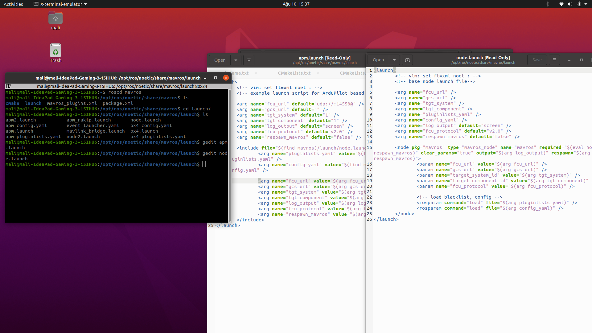
### 6. `~/.bashrc` Configuration Example

This is an example of a configuration that should be added to your `~/.bashrc` file. It sets up necessary environment variables and useful aliases for running the simulation.

```bash
# Set Go path
export PATH=$PATH:/usr/local/go/bin

# Add ArduPilot tools to path
export PATH=$PATH:$HOME/ardupilot/Tools/autotest
export PATH=/usr/lib/ccache:$PATH

# --- Aliases for running SITL ---
# Default SITL for ArduPlane
alias sitl="sim_vehicle.py --console --map -v ArduPlane"
# SITL for the primary Gazebo plane (SysID 1, Instance 0)
alias sitl_gazebo="sim_vehicle.py --sysid 1 -v ArduPlane -f gazebo-zephyr --map --console -I0"
# SITL for the opponent/second plane (SysID 2, Instance 1)
alias sitl_rakip="sim_vehicle.py --sysid 2 -v ArduPlane -f gazebo-zephyr --map --console -I1"
# MAVProxy to view both vehicles on one map
alias sitl_harita="mavproxy.py --master=tcp:127.0.0.1:5762 --master=tcp:127.0.0.1:5772 --map --console"

# --- Alias for running Gazebo ---
alias gazebo_plane="gazebo --verbose -s libgazebo_ros_api_plugin.so zephyr_ardupilot_demo.world"
#alias gazebo_plane="gazebo --verbose zephyr_ardupilot_demo.world"

# --- Gazebo Environment Variables ---
source /usr/share/gazebo/setup.sh
export GAZEBO_MODEL_PATH=~/ardupilot_gazebo/models:${GAZEBO_MODEL_PATH}
export GAZEBO_MODEL_PATH=~/ardupilot_gazebo/models_gazebo:${GAZEBO_MODEL_PATH}
export GAZEBO_RESOURCE_PATH=~/ardupilot_gazebo/worlds:${GAZEBO_RESOURCE_PATH}
export GAZEBO_PLUGIN_PATH=~/ardupilot_gazebo/build:${GAZEBO_PLUGIN_PATH}

# --- ROS Environment Variables ---
source /opt/ros/noetic/setup.bash
source /home/mali/catkin_ws/devel/setup.bash

